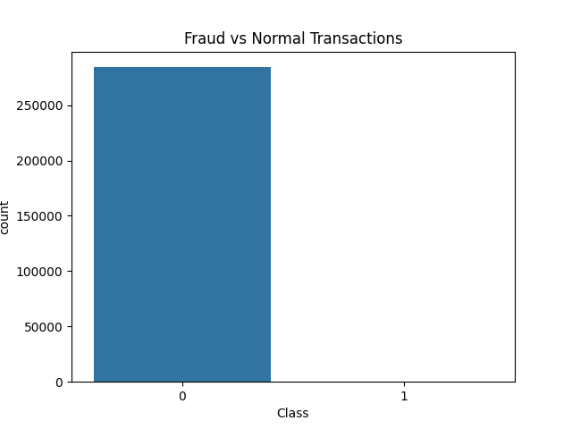
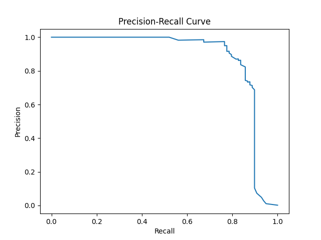

# Credit Card Fraud Detection

Machine Learning pipeline for detecting fraudulent credit card transactions using imbalanced classification techniques and threshold tuning.

---

## Overview

This project builds and evaluates machine learning models to identify fraudulent transactions in a highly imbalanced financial dataset.
The focus is on maximizing fraud detection recall while maintaining a low false positive rate.

---

## Dataset

* 284,807 total transactions
* 492 fraud cases (~0.17%)
* Features include anonymized PCA components (V1–V28), transaction time, and transaction amount

Dataset not included due to GitHub file size limits.
Download from:
https://www.kaggle.com/datasets/mlg-ulb/creditcardfraud

Place `creditcard.csv` inside the `data/` directory.

---

## Methodology

* Train-test split with stratification
* Feature scaling using StandardScaler
* Class imbalance handling using SMOTE
* Model training:

  * Logistic Regression
  * Random Forest Classifier
* Evaluation using:

  * Precision / Recall / F1-score
  * Confusion Matrix
  * Precision-Recall Curve
* Probability threshold tuning for improved fraud detection sensitivity

---

## Results

**Random Forest (Threshold = 0.3)**

* Fraud Recall: **89%**
* Fraud Precision: **70%**
* False Positives: **37**
* Missed Fraud Cases: **11**

Model successfully detects the majority of fraudulent transactions while maintaining a very low false alarm rate.

---

## Key Insights

* Accuracy is not meaningful for highly imbalanced datasets
* Recall is critical in fraud detection systems
* Threshold tuning allows balancing operational risk and alert volume
* Tree-based models capture nonlinear fraud patterns effectively

---

## Visualizations

Fraud Distribution


Precision-Recall Curve


---

## Run Instructions

```bash
git clone https://github.com/YOUR_USERNAME/credit-card-fraud-detection.git
cd credit-card-fraud-detection
pip install -r requirements.txt
jupyter notebook
```

Open:

```
notebooks/fraud_detection.ipynb
```

---

## Future Work

* Gradient boosting models (XGBoost / LightGBM)
* Hyperparameter tuning
* Model deployment API
* Real-time fraud scoring system

---

## Author

Naveenchandra Nallamothu
B.S. Computer Science – George Mason University
