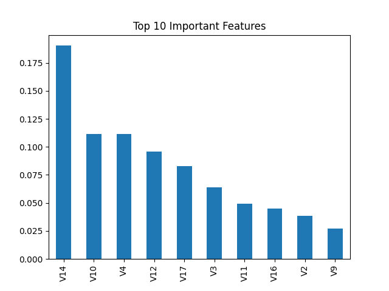
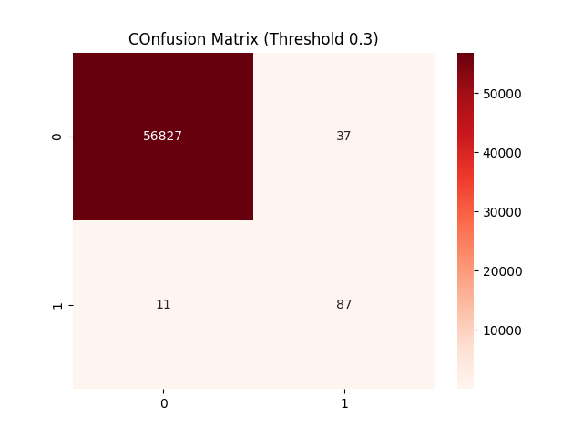

# Credit Card Fraud Detection

Machine Learning pipeline for detecting fraudulent credit card transactions using imbalanced classification techniques and threshold tuning.

---

## Overview

This project builds and evaluates machine learning models to identify fraudulent transactions in a highly imbalanced financial dataset.
The focus is on maximizing fraud detection recall while maintaining a low false positive rate.

---

## Tech Stack

* Python

* Pandas — data preprocessing and analysis

* NumPy — numerical computations

* Scikit-learn — machine learning models and evaluation

* Imbalanced-learn (SMOTE) — handling class imbalance

* Matplotlib — data visualization

* Seaborn — statistical visualization

* Jupyter Notebook — experimentation and model development

## Dataset

* 284,807 total transactions
* 492 fraud cases (~0.17%)
* Features include anonymized PCA components (V1–V28), transaction time, and transaction amount

Dataset not included due to GitHub file size limits.
Download from:
https://www.kaggle.com/datasets/mlg-ulb/creditcardfraud

Place `creditcard.csv` inside the `data/` directory.

---

## Project Structure

* data/ → raw dataset  
* notebooks/ → model development notebook  
* images/ → saved visualizations  
* models/ → trained model file  
* requirements.txt → dependencies  
* results.md → detailed metrics

## Methodology

* Train-test split with stratification
* Feature scaling using StandardScaler
* Class imbalance handling using SMOTE
* Model training:

  * Logistic Regression
  * Random Forest Classifier

* Evaluation using:

  * Precision / Recall / F1-score
  * Confusion Matrix
  * Precision-Recall Curve
* Probability threshold tuning for improved fraud detection sensitivity

* Final Random Forest model saved using joblib for future inference.
---

## Results

### Model Performance (Random Forest, Threshold: 0.3)

| Metric | Value |
|------|------|
| Recall (Fraud) | 0.89 |
| Precision (Fraud) | 0.70 |
| False Positives | 37 |
| False Negatives | 11 |

Model successfully detects the majority of fraudulent transactions while maintaining a very low false alarm rate.

---

## Key Insights

* Accuracy is not meaningful for highly imbalanced datasets
* Recall is critical in fraud detection systems
* Threshold tuning allows balancing operational risk and alert volume
* Tree-based models capture nonlinear fraud patterns effectively

---

## 📊 Visualizations

### Fraud Class Distribution
Shows extreme class imbalance in the dataset.


---

### Precision–Recall Curve
Evaluates model performance on imbalanced data.


---

### Feature Importance (Random Forest)
Top features contributing to fraud prediction.



---

### Confusion Matrix (Threshold = 0.3)
Model performance after threshold tuning.


---

## Run Instructions

```bash
git clone https://github.com/Ironclad1738281/credit-card-fraud-detection.git
cd credit-card-fraud-detection
pip install -r requirements.txt
jupyter notebook
```

Open:

```
notebooks/fraud_detection.ipynb
```

---

## Conclusion

This project demonstrates how machine learning models can be tuned to prioritize fraud detection performance in highly imbalanced financial datasets. Threshold optimization and proper evaluation metrics will significantly improve real-world model usefulness.

## Future Work

* Gradient boosting models (XGBoost / LightGBM)
* Hyperparameter tuning
* Model deployment API
* Real-time fraud scoring system

---

## Author

Naveenchandra Nallamothu
B.S. Computer Science – George Mason University
